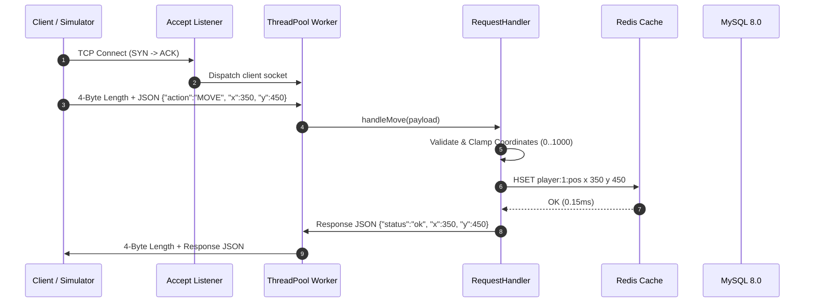

# System Architecture & Technical Design

## 1. Executive Summary

The **Multiplayer Game Server & Distributed Load Testing Platform** is a high-performance, concurrent backend architecture engineered in **C++17** designed to sustain tens of thousands of requests per second with sub-millisecond median latency.

The platform integrates multi-threaded socket concurrency, in-memory Redis session caching, durable MySQL 8.0 relational persistence, Prometheus/Grafana real-time observability, and a visual HTML5 Web Arena for real-time monitoring and gameplay.

---

## 2. High-Level Architecture Topology

```
                                    CLIENT LAYER
                   ┌──────────────────────────────────────────────┐
                   │  C++ Player Simulator (Load Generator Bots)  │
                   │  Visual HTML5 Web Arena (Human Playable UI)  │
                   └──────────────────────┬───────────────────────┘
                                          │ TCP (Framed JSON) / HTTP REST
                                          ▼
                               APPLICATION SERVER LAYER
                   ┌──────────────────────────────────────────────┐
                   │               C++ GAME SERVER                │
                   │  ┌─────────────────┐    ┌─────────────────┐  │
                   │  │ Accept Listener │    │  Thread Pool    │  │
                   │  │ (Main Thread)   │───►│  (256 Workers)  │  │
                   │  └─────────────────┘    └────────┬────────┘  │
                   │                                  │           │
                   │  ┌───────────────────────────────▼────────┐  │
                   │  │     RequestHandler & Wire Framer       │  │
                   │  │  • Action Validation (JOIN, MOVE...)   │  │
                   │  │  • Combat Resolution & Clamping        │  │
                   │  └───────┬──────────────┬─────────────┬───┘  │
                   │          │              │             │      │
                   │  ┌───────▼──────┐ ┌─────▼─────┐ ┌─────▼───┐  │
                   │  │ GameState    │ │ RedisPool │ │ Database│  │
                   │  │ World State  │ │ (RESP)    │ │ (MySQL) │  │
                   │  └──────────────┘ └───────────┘ └─────────┘  │
                   │          ▲                                   │
                   │  ┌───────┴──────────────┐                    │
                   │  │ HttpMetricsServer    │ (Port 9100)        │
                   │  │ (Prometheus Exporter)│                    │
                   │  └──────────────────────┘                    │
                   └──────────────────────┬───────────────────────┘
                                          │
                   ┌──────────────────────┴───────────────────────┐
                   ▼                                              ▼
        IN-MEMORY CACHE (Redis)                        PERSISTENCE (MySQL 8.0)
 ┌────────────────────────────────────┐         ┌─────────────────────────────────┐
 │ • Key: player:{id}:session (TTL)   │         │ • players (Score, High Score)   │
 │ • Hash: player:{id}:pos (x, y)     │         │ • matches (Status, Kills)       │
 │ • Connection Pooling (32 Sockets)  │         │ • game_events (Audit Log)       │
 │ • Latency: ~0.15 ms                │         │ • test_runs (Benchmark History) │
 └────────────────────────────────────┘         └─────────────────────────────────┘
                   ▲
                   │ Scrapes /metrics
 ┌─────────────────┴──────────────────┐
 │      OBSERVABILITY STACK           │
 │  • Prometheus (Time Series Engine) │
 │  • Grafana (Live 6-Panel Dashboard)│
 └────────────────────────────────────┘
```

---

## 3. Component Breakdown

### 3.1. Network Framing & Serialization Layer
- **`MessageFramer`**: Implements a strict binary framing protocol: `[4-Byte Little-Endian Length Prefix] + [UTF-8 JSON Payload]`.
- Enforces a maximum payload boundary (1MB) to prevent buffer allocation overflow attacks.
- Robust against TCP stream segmentation via `readExact()` and `writeAll()`.

### 3.2. Concurrency & Execution Engine
- **`ThreadPool`**: Fixed worker thread pool with thread-safe `std::condition_variable` work queue.
- Decouples client accept loop from connection processing, preventing network socket saturation.

### 3.3. Request Dispatcher & Game State
- **`RequestHandler`**: Validates input types and executes gameplay opcodes:
  - `JOIN`: Initializes player state and cache entry.
  - `MOVE`: Validates and clamps coordinates (0–1000).
  - `ATTACK`: Resolves damage (25 HP/hit), awards elimination score (+100 PTS), and updates killer stats.
  - `CHAT`: Enforces maximum message length (256 bytes).
  - `GET_STATE`: Returns atomic world snapshot for spectators and UI.
  - `LEAVE`: Persists final scores to MySQL and cleans up cached sessions.
- **`GameState`**: Thread-safe in-memory match manager with circular ring-buffer event log (last 1000 events).

### 3.4. Caching & Persistence Subsystems
- **`CacheManager` & `RedisPool`**: Native C++ RESP socket client managing a pool of persistent connections.
- **`DatabaseManager`**: Native `libmysqlclient` integration with compiled parameterized statements (`MYSQL_STMT`) preventing SQL injection.

### 3.5. Real-Time Observability Exporter
- **`HttpMetricsServer`**: Embedded HTTP/1.1 server running on a dedicated thread (port 9100).
- Emits Prometheus text exposition format with lock-free atomic counters, gauges, and latency histogram buckets.

---

## 4. End-to-End Request Lifecycle


